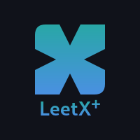

<p align="center">
  
</p>

# LeetX+

**Version:** 1.0.0

LeetX+ is a Chrome extension that integrates a side panel directly into LeetCode. It uses AI models to automatically solve coding interview problems and streamlines your workflow with features like Copy, Auto-Paste, and Auto-Type.

---

## Features

- Generates code solutions via Google Gemini or OpenRouter AI.
- Copy, Auto-Paste, and Auto-Type (with human-like delay).
- Recent solutions history with direct links back to problems.
- Clear history with one click.
- Info and Documentation panels within the extension.

---

## User Guide

### Installing the Extension

For end users, LeetX+ is available on the Chrome Web Store (coming soon).

Alternatively, to load it manually:

1. Download the latest release ZIP from the releases page and unzip it.
2. Open `chrome://extensions` in Chrome.
3. Enable **Developer mode**.
4. Click **Load unpacked** and select the unzipped folder.

### Using LeetX+

1. Navigate to a LeetCode problem and switch to the **Code** tab (not the Description tab).
2. Click the LeetX+ icon in your Chrome toolbar to open the side panel.
3. On first run, follow the onboarding wizard to:
   - Pin the extension.
   - Enter your API key in **Settings**.
   - Select your preferred AI provider.
   - Click **Solve it** to generate a solution.
4. Use the **Copy**, **Auto-Paste**, or **Auto-Type** buttons to insert the solution.
5. View recent solutions in the **History** section and clear history with one click.
6. Revisit help at any time via the ⚙️ **Settings** or ℹ️ **Info** icons.

---

## First Run & Onboarding

After loading the extension for the first time:

1. Click the LeetX+ icon in your Chrome toolbar to open the side panel.  
2. You will see a quick walkthrough guiding you to enter your API key and basic usage steps.  
3. Click **Get Started** to complete setup.  
4. To revisit setup instructions later, open the Info panel (via the ℹ️ icon).  

Make sure you've added your API key under **Settings** before clicking **Solve it** on a LeetCode problem page.

---

## Developer Setup

- Install dependencies:

  ```bash
  npm install
  ```

- Start development build (watches for changes):

  ```bash
  npm run start
  ```

- Open `chrome://extensions` in your browser.
- Enable **Developer mode**.
- Click **Load unpacked** and select the project root.
- Make changes in `src/`, the bundle will rebuild automatically.

⚠️ **Note for Developers:** The following section is intended for developers who want to build or contribute. End users can ignore it.

---

## Production Build & Packaging

1. Build for production:

   ```bash
   npm run build
   ```

2. (Optional) Pack extension:

   ```bash
   npm run pack
   ```

3. Upload `dist/` contents or packaged `.crx` to the Chrome Web Store.

---

## Contributing

- Ensure all new code is linted and tested.
- Submit PRs against the `main` branch.

---

© 2025 Joydip Biswas. Licensed under the ISC License.
